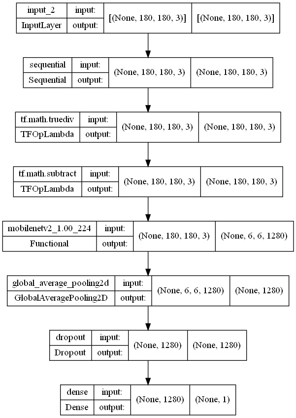
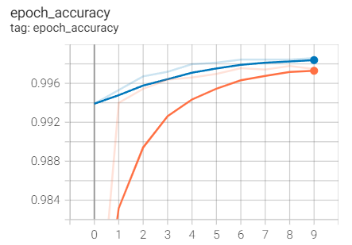
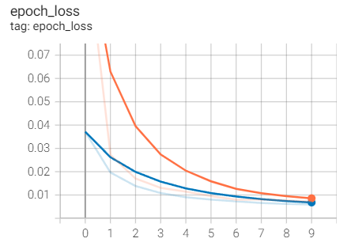
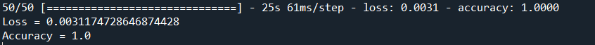
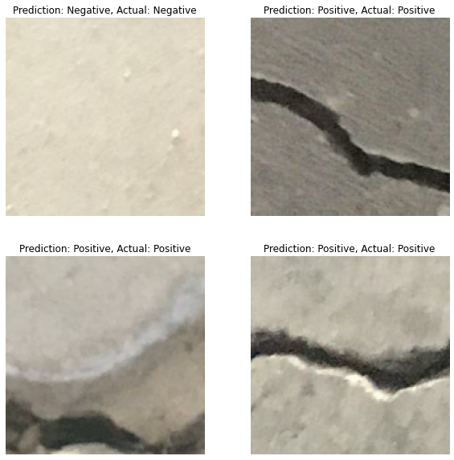

# Concrete Crack Image Classification Using Convolutional Neural Network

## 1. Summary
The aim of the project is to accurately identify cracks on concrete using a convolutional neural network model. It is modelled as a binary classification problem, where it is negative when there are no cracks and positive when there are cracks. This project is inspired by a documentation on the official TensorFlow website. The documentation can be found [here](https://www.tensorflow.org/tutorials/images/transfer_learning).

## 2. Methodology
### 2.1 IDE and Frameworks
This project was created using Spyder as the IDE. The framework in this project is Tensorflow Keras. Libraries such as numpy and matplotlib are also used in this project.

### 2.2 Data Source
The data used in this project is obtained from [Concrete Crack Images for Classification](https://data.mendeley.com/datasets/5y9wdsg2zt/2).

### 2.3 Data Pipeline
The images are loaded together with their labels, and is split into train-validation set of 80 to 20 ratio. The validation set is the further split into validation-test sets by firstly determining how many batches of data there are in the validation set, then splitting 20% of the data as test data. Data augmentation is applied to introduce sample diversity by applying random flips and rotations. 

### 2.4 Model Pipeline
Transfer learning is applied in building the deep learning model of this project. The MobileNetV2 model developed by Google is used as the base model. Firstly, a preprocessing layer is created preprocessing method included with the model to rescale the images as the model expects pixel values of [-1, 1], but the images are currently in [0, 255].

As for the feature extraction, the convolutional base created is freezed(to prevent the weights from being updated during training) and used as the feature extractor.

A global classification layer and a dense layer are used as the classifiers to generate predictions.

The structure of the model is shown in the figure below.

The model is trained using a batch size of 32 and 10 epochs. The model reaches an accuracy of 98% and validation accuracy of 97%. The training results is shown in the figures below.

 

### 3. Results
The model is then evaluated using the test data prepared. The results obtained from the evaluation is shown in the figure below.

The model is also used to make predictions and compared with the actual results as show below.

